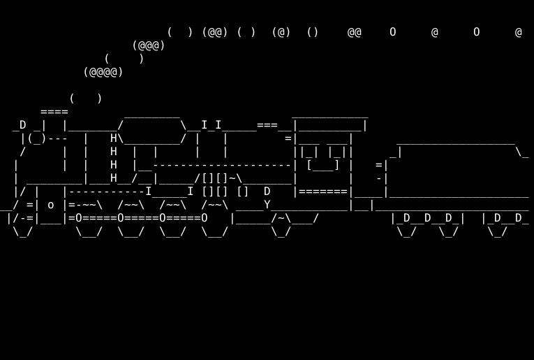
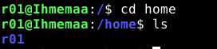
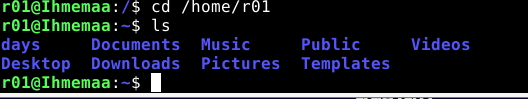
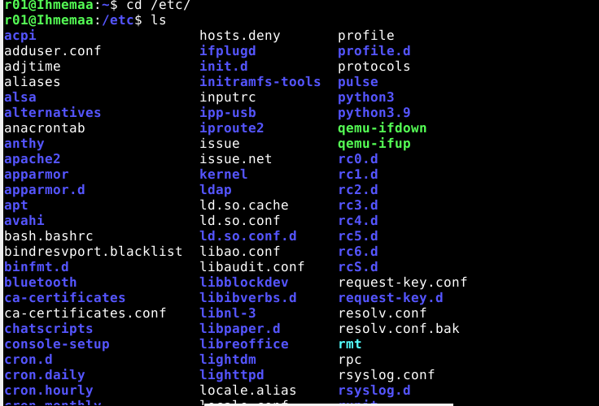
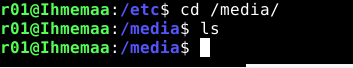

 
 # x)

 
 
 
 
## FSF

 FSF eli Free Software Foundation määrittää artikkelissaan "What is Free Software?" (https://www.gnu.org/philosophy/free-sw.html), mikä on ilmaisohjelma ja miten ilmaisohjelmia saa käyttää.
 
* Ilmaisohjelma arvostaa sen käyttäjän vapautta ja yhteisöä
* Ilmaisohjelmia saa käyttää miten itse haluaa ja mihin tarkoitukseen haluaa
* Ilmaisohjelmien toimivuutta saa tutkia ja muuttaa omaan käyttötarkoitukseen sopivaksi 
* Ilmaisohjelmia saa muuttaa ja jakaa eteenpäin
* Ilmaisohjelmat voivat olla myös kaupallisia

## Avoimen lähdekoodin lisenssit
 Mikko Välimäki esittelee väitöskirjassaan "The rise of open source licensing" (lib.tkk.fi/Diss/2005/isbn9529187793/isbn9529187793.pdf) luvuissa 5.1.1 - 5.1.4 mitä avoimen lähdekoodin lisenssi pitää sisällään.

* Avoimen lähdekoodin lisenssi hyväksyy kopioimisen, levittämisen ja modifikaation
* Ohjelmiston lisensointi avoimen lähdekoodin lisenssillä ei kuitenkaan tarkoita, että ohjelma olisi tekijänoikeudeton
* Avoimen lähdekoodin lisenssillä ei ole lisenssien yhteensopivuuden, takuiden tai muodollisuuksien suhteen vaatimuksia.

 
 # H3
 Harjoituksen tarkoituksena on tutustua Linuxin eri ohjelmien lisensseihin ja harjoitella pip- ja grep-komentoja. Tein harjoituksen omalla pöytäkoneella 25.01.2023
 

 
 
### Laitteisto
 
* Käyttöjärjestelmä	Microsoft Windows 10 Enterprise LTSC 64 bit
* Prosessori i5-6600
* RAM 16 GB
* Virtuaaliohjelmisto : Oracle VM VirtualBox
* Virtuaalikoneen käyttöjärjestelmä: Debian-live-11.6.0-amd64-xfce+nonfree.iso

## Aloitin harjoituksen kello 20:30 harjoituksessa H2 asentamien ohjelmien lisensseihin tutustumiseen

### CMatrix
 * Löysin ohjelman github reposition (https://github.com/abishekvashok/cmatrix/blob/master/README.md#license)
 * Lisenssi: GNU GPL v3
 * GNU GPL v3 on vapaa lisenssi
 * Saa käyttää kaupallisesti ja yksityisesti
 * Saa muokata ja jakaa
 

### Cowsay
 * Löysin ohjelman github reposition (https://github.com/tnalpgge/rank-amateur-cowsay)
 * Lisenssi: GNU GPL v3
 * GNU GPL v3 on vapaa lisenssi
 * Saa käyttää kaupallisesti ja yksityisesti
 * Saa muokata ja jakaa

### SL
  * Löysin ohjelman github reposition (https://github.com/mtoyoda/sl)
  * Copyright 1993,1998,2014 Toyoda Masashi (mtoyoda@acm.org)
  * Annetaan lupa kopioida, levittää ja muokata ohjelmaa
  

 ## Seuraavaksi harjoittelin grep-komentoa käyttäen säännöllisiä lausekkeita (regular expressions) (21:31)
 
  Hyödyntämällä viime tehtävässä luomaani tekstitiedostoa 
  
  
  
  ja komentoa 
  
     
  
  
     $ sudo lshw -short -sanitize
     
  Komennolla käynnistin lshw ohjelman ja listasin virtuaalikoneen ominaisuudet
  
  

  
  
  Listauksessa näkyy, kuinka olin antanut virtuaalikoneelle 5 GB RAMia ja että virtuaalikone pyörii samalla prosessorilla, kuin pöytäkoneeni.
  
  ## Seuraavaksi asensin itselleni kolme mieluisaa komentorivi ohjelmaa (11:49)
  
  Valitisin ohjelmiksi cmatrix, cowsay ja sl
  
    $ sudo apt-get install cmatrix cowsay sl
    
  Komennolla asensin kaikki kolme ohjelmaa yhtäaikaa
  
     cmatrix
     cowsay "hello"
     sl
     
Komennoilla pääsin testaamaan eri ohjelmia

## Seuraavaksi tutustuin tärkeimpiin kansioihin ja tiedostoihin Linux-käyttöjärjestelmässä (12:08)
    cd /
   
   
   Komennolla sain esiin juurihakemiston, jonka sisältä töytyy kaikki tiedostot
   
    ls 
    
   Komento listaa tiedostot ja hakemistot valitussa hakemistossa
   
   
   
    cd /home/
  
   Komennolla pääsin kotihakemistoon, josta löytyy kaikki käyttäjät. Minun tapauksessa vain oma käyttäjäni.
   
   
   
   
    cd /home/r01
  
    
   Komennoilla pääsin oman käyttäjän hakemistoon
   
   
   
    cd /etc/
    
   Komenolla pääsin järjestelmän asetuksiin
   
   
   
    cd /media/
   
  Komennolla pääsin siirrettävien tallenusvälineiden hakemistoon
  
  
  
    cd /var/log/
    
   Komenolla pääsin tarkastelemaan koko järjestelmän lokeja
   
  
 
  
  
 ## Grepin testaus 13:01
 
 Aloitin tarkistamalla, että minulla on grep käytössä ja sen jälkeen luomalla uuden kansion ja sinne tekstiä nano-editorilla käyttäen komentoja
 
    grep
    $ mkdir testigrep
    nano hello
   
     

    

 
    grep -c "Hello" hello
    
   Komenolla hain lainaismerkkien sisällä olevan sanan lukumäärää kansiossa "hello"
   
   

    grep -v "Hello" hello
    
   Komennolla sain haettua kaikki sanat jotka eivät vastanneet lainausmerkkien sisällä olevaa sanaa
   
  
 
 
 
    grep --color "Hello" hello
    
 Värjäsin kaikki Hello sanat kyseisessä tiedostossa
 
 
 
 
 ## Lopuksi (13:43)
 
 Tässä harjoituksessa opettelin Debian-käyttöjärjestelmän ohjelmistojen ja hakemistojen käyttöä. Vastaan ei tullut ongelmatapauksia.
 
## Lähteet

What is Free Software? (https://www.gnu.org/philosophy/free-sw.html)

Välimäki 2005: Rise of Open Source: 5 Open Source Licenses as Alternative Governance Mechanisms: 5.1.1 - 5.1.4 (lib.tkk.fi/Diss/2005/isbn9529187793/isbn9529187793.pdf)

How To Use grep Command In Linux / UNIX With Practical Examples,  Vivek Gite - 20.1.2023 (https://www.cyberciti.biz/faq/howto-use-grep-command-in-linux-unix/)

11 Fun Linux Command-Line Programs You Should Try When Bored, Deepesh Sharma - 1.11.2022 (https://www.makeuseof.com/fun-linux-command-line-programs/)

UNIX Basic commands: grep (https://www.techonthenet.com/unix/basic/grep.php)

#### Tehnyt Roi Partanen 
 
