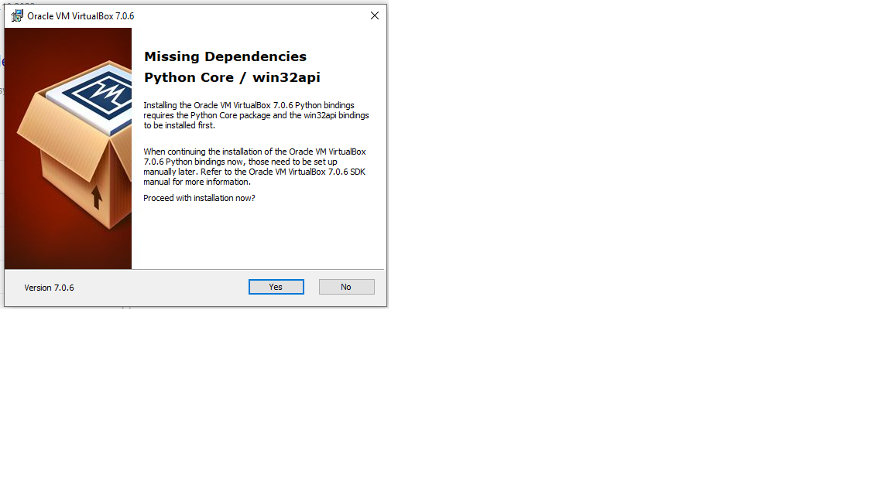
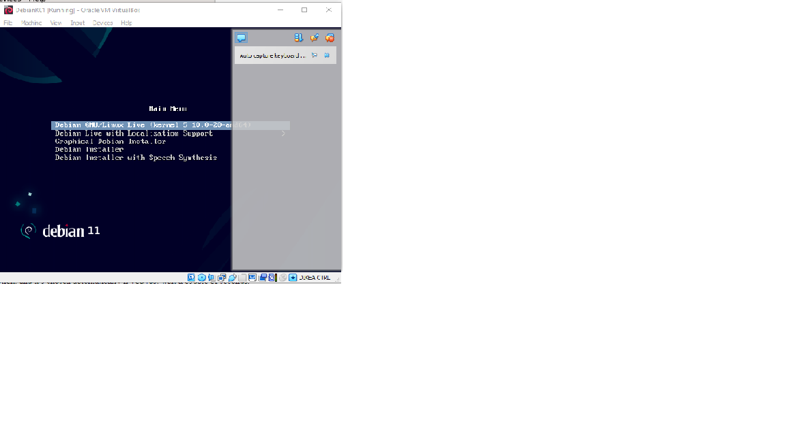

# Debian Linuxin asentaminen virtuaalikoneeseen
Harjoituksen tarkoituksena on ensin virtuaalikoneen asennus ja sen jälkeen Linux Debianin asentaminen sille. Tein harjoituksen 18.01.2023 omalla pöytäkoneella.

 ###  Tiedot
 
 Prosessori i5-6600
 
 RAM 16 GB
 
 Käyttöjärjestelmä Windows 10 64 bit
 
 
## Asentaminen

Aloitin lataamalla Linux Debianin uusimman version (11.6.0) ja VirtualBox-applikaation. VirtualBox-applikaation asentamisen aikana tuli viesti puuttuvista riippuvuuksista.

Muuten VirtualBox asensi itsensä onnistuneesti installerin kautta. Seuraavaksi lisäsin Debianin ISO-kuvan VirtualBoxiin Tero Karvisen antamien ohjeiden mukaan. Onnistuneen boottauksen jälkeen testasin, että hiiri, näppäimistö, netti ja näyttö toimivat menemällä applications valikosta web browseriin ja menemällä googlen sivuille. Seuraavaksi asensin Debianin Calamares-installerin avulla. Kieleksi valitsin American English ja sijainniksi Helsinki. Tämän jälkeen valitsin suomalaisen näppäimistön ja pyyhin virtuaalikoneen levyn, jonka jälkeen loin käyttäjätiedot järjestelmälle. Seuravaaksi odotin käyttöjärjestelmän asennusta.

Käyttöjärjestelmän asennettua boottasin koneen uudestaan ja testasin netti selaimen avulla, että kaikki toimii.
Testauksen jälkeen menin Terminal Emulaattoriin ja
>$ sudo apt-get update 

komennolla hain saatavilla olevat päivitykset

ja 

>$ sudo apt-get -y dist-upgrade

komennolla päivitin kaiken

viimeiseksi asensin palomuurin terminaalin kautta ja laitoin sen päälle komennoilla:

>$ sudo apt-get -y install ufw

ja

>$ sudo ufw enable

Tämän jälkeen reeboottasin järjestelmän ja pääsin nauttimaan Linuxin käytöstä.
