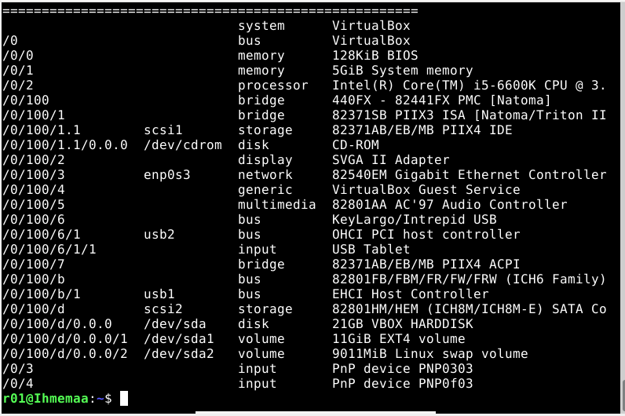
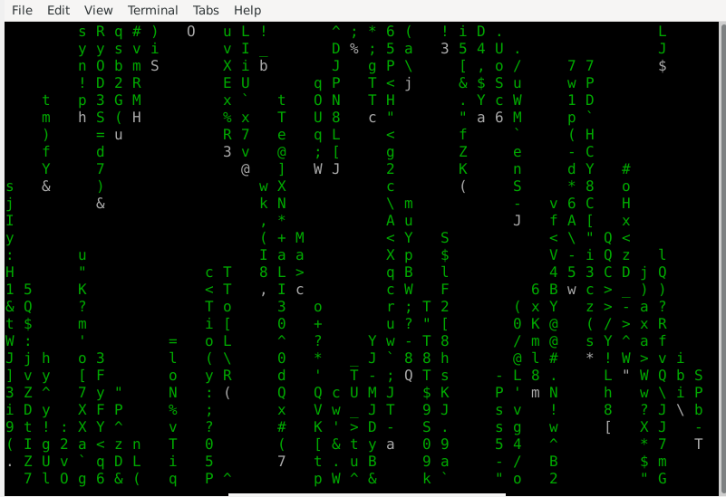
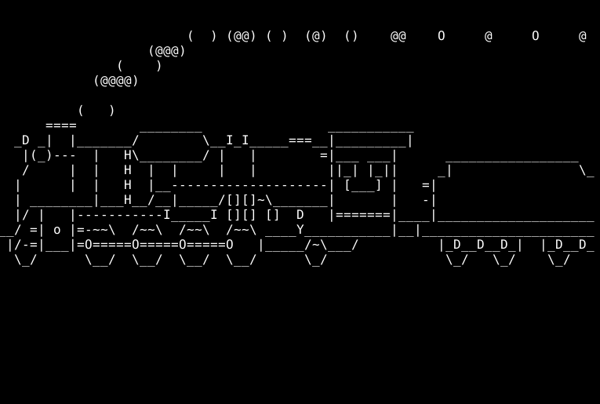
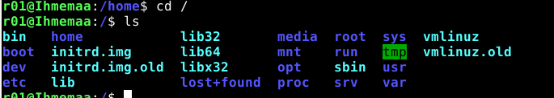
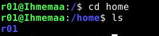
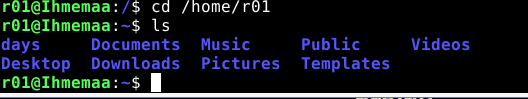
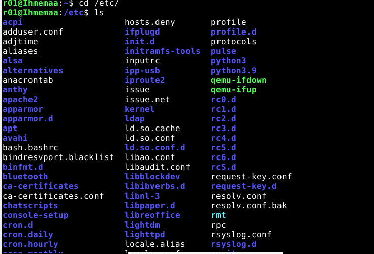
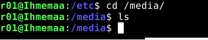
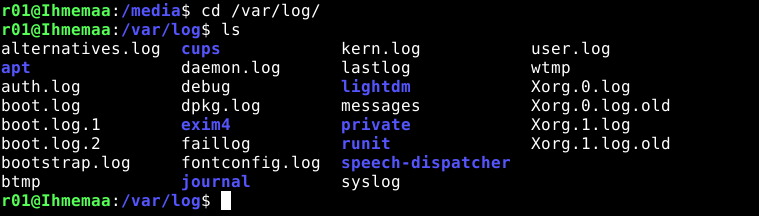

 
 ### x)
 Tero Karvisen sivuilla https://terokarvinen.com/2020/command-line-basics-revisited/?fromSearch=command%20line%20basics%20revisited löytyy katsaus Linuxin käyttöjärjestelmän eri komentoihin ja ominaisuuksiin.
 
 Huomioita:
 * Linuxissa ollaan aina hakemiston sisällä
* Pico ja Nano ovat hyviä tekstieditoreita
* Linuxiin asennetaan ohelmistoa pakettien avulla
 
 # Komentaja Pingviini
 Harjoituksen tarkoituksena on tutustua Linuxin eri komentoihin ja hakemistoihin ja harjoitella niiden käyttöä. Tein harjoituksen omalla pöytäkoneella 22.01.2023
 

 
 
### Laitteisto
 
* Käyttöjärjestelmä	Microsoft Windows 10 Enterprise LTSC 64 bit
* Prosessori i5-6600
* RAM 16 GB
* Virtuaaliohjelmisto : Oracle VM VirtualBox
* Virtuaalikoneen käyttöjärjestelmä: Debian-live-11.6.0-amd64-xfce+nonfree.iso

## Aloitin harjoituksen kello 11:08 asentamalla micro editorin

       $ sudo apt-get update
       
  Komennolla ja salasanan syöttämällä sain haettua saatavilla olevat päivitykset

      $ apt-cache show micro
      
   Komennolla sain löydettyä micro editorin

     $ sudo apt-get -y install micro
     
  Komennolla sain asennettua micro tekstieditorin
     

 ## Seuraavaksi tutkin virtuaalikoneen ominaisuuksia (11:27)
 
  Hyödyntämällä viime tehtävän komentoja asensin LSHW ohelman, jonka avulla pystyy tutkimaan käyttöjärjestelmän ominaisuuksia
  
     $ sudo lshw -short -sanitize
     
  Komennolla käynnistin lshw ohjelman ja listasin virtuaalikoneen ominaisuudet
  
  

  
  
  Listauksessa näkyy, kuinka olin antanut virtuaalikoneelle 5 GB RAMia ja että virtuaalikone pyörii samalla prosessorilla, kuin pöytäkoneeni.
  
  ## Seuraavaksi asensin itselleni kolme mieluisaa komentorivi ohjelmaa (11:49)
  
  Valitisin ohlemiksi cmatrix, cowsay ja sl
  
    $ sudo apt-get install cmatrix cowsay sl
    
  Komennolla asensin kaikki kolme ohjelmaa yhtäaikaa
  
     cmatrix
     cowsay "hello"
     sl
     
Komennoilla pääsin testaamaan eri ohjelmia

## Seuraavaksi tutustuin tärkeimpiin kansioihin ja tiedostoihin Linux-käyttöjärjestelmässä (12:08)
    cd /
   
   
   Komennolla sain esiin juurihakemiston, jonka sisältä töytyy kaikki tiedostot
   
    ls 
    
   Komento listaa tiedostot ja hakemistot valitussa hakemistossa
   
   
   
    cd /home/
  
   Komennolla pääsin kotihakemistoon, josta löytyy kaikki käyttäjät. Minun tapauksessa vain oma käyttäjäni.
   
   
   
   
    cd /home/r01
  
    
   Komennoilla pääsin oman käyttäjän hakemistoon
   
   
   
    cd /etc/
    
   Komenolla pääsin järjestelmän asetuksiin
   
   
   
    cd /media/
   
  Komennolla pääsin siirrettävien tallenusvälineiden hakemistoon
  
  
  
    cd /var/log/
    
   Komenolla pääsin tarkastelemaan koko järjestelmän lokeja
   
  
 
  
   
   
   
   
   
   
   

